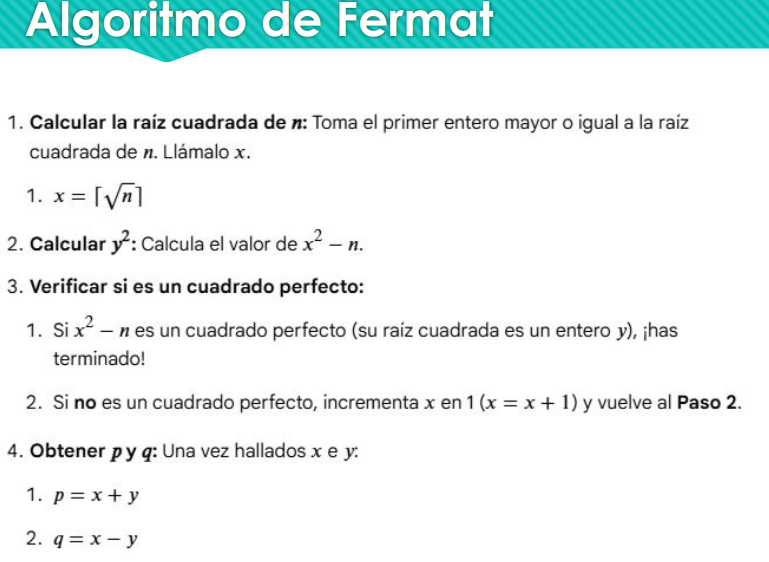
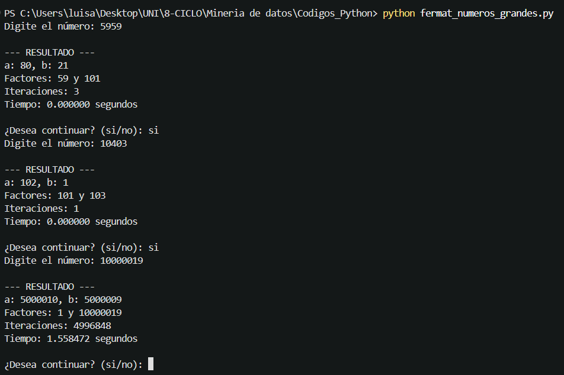
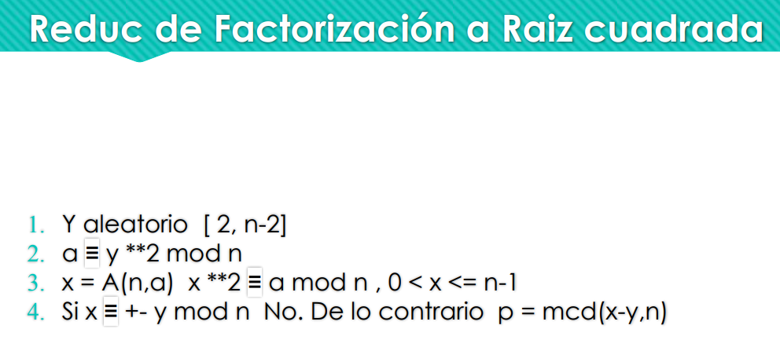
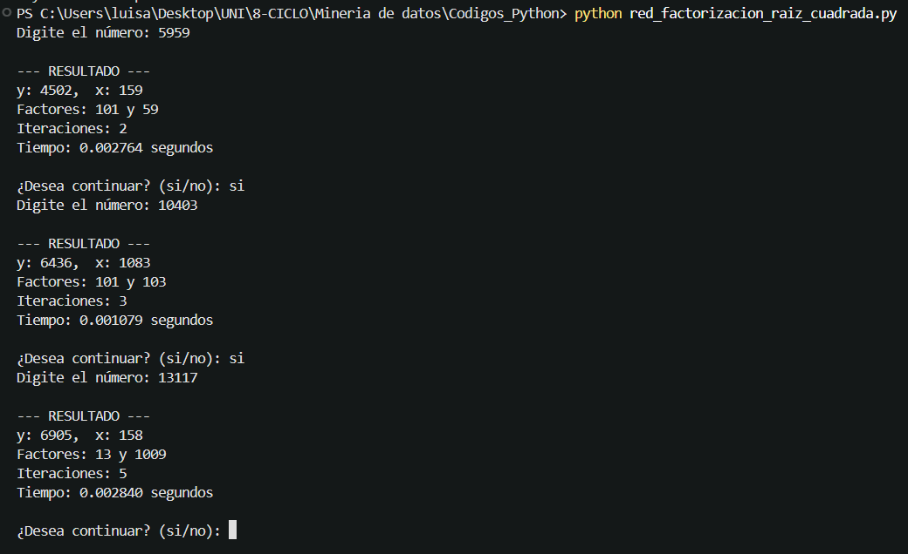

# Laboratorio 02 : Fermat y reducción de factorización a raíz cuadrada

Para la prueba en ambos códigos , utilizare los números que se encuentran en ambos códigos como comentario.

## Primer código (Algoritmo de Fermat)

Utilizando la teoría de la clase.

    

Visualizamos los siguientes resultados.

    

## Segundo código (Factorización a raíz cuadrada)

Utilizando la teoría de la clase.

    

Visualizamos los siguientes resultados.

    

A comparación del primer código (Fermat) , al digitar **10000019** , el segundo código no podrá resolverlo ya que es practicamente no factorizable.

